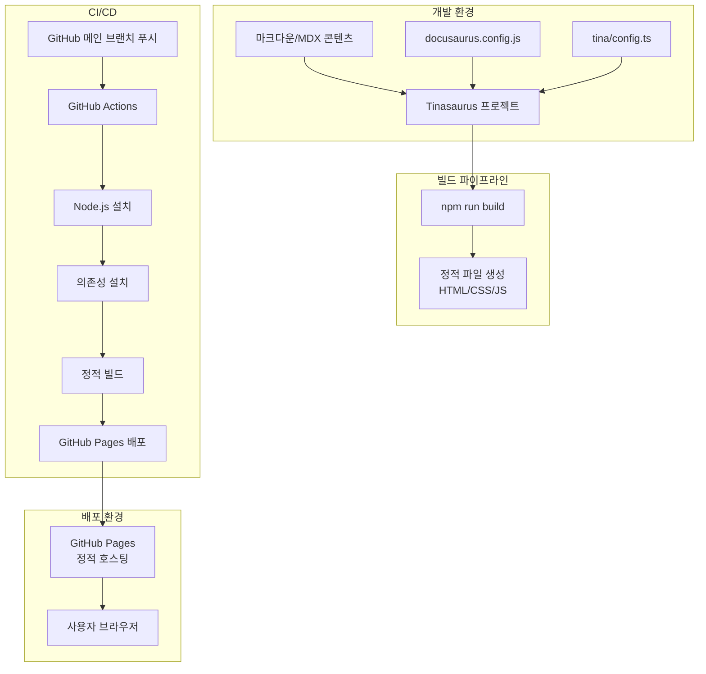
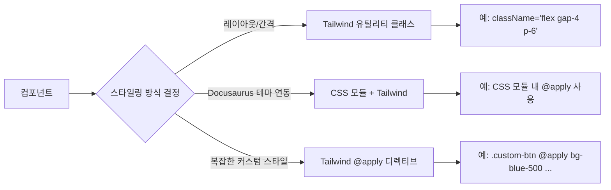

# 기술 설계 문서: Tinasaurus 예제 페이지

## 개요

Tinasaurus(TinaCMS + Docusaurus)를 활용하여 예제 문서 사이트를 구축하고, GitHub Pages를 통해 정적 사이트로 배포하는 프로젝트의 기술 설계 문서입니다.

Tinasaurus는 Docusaurus의 정적 사이트 생성 기능과 TinaCMS의 시각적 콘텐츠 편집 기능을 결합한 도구입니다. 이 프로젝트에서는 Tinasaurus 템플릿을 기반으로 프로젝트를 초기화하고, 예제 마크다운 문서를 작성하며, GitHub Actions를 통해 GitHub Pages에 자동 배포하는 파이프라인을 구성합니다.

### 주요 기술 결정 사항

- **Tinasaurus 템플릿 사용**: `create-docusaurus` 대신 Tinasaurus 공식 템플릿(`tinasaurus`)을 사용하여 TinaCMS 통합이 사전 구성된 프로젝트를 생성합니다.
- **정적 빌드 모드**: TinaCMS의 로컬 모드가 아닌 정적 빌드 모드를 사용하여 GitHub Pages에서 서버 없이 동작하도록 합니다.
- **GitHub Actions 기반 CI/CD**: 메인 브랜치 푸시 시 자동으로 빌드 및 배포가 실행되도록 GitHub Actions 워크플로우를 구성합니다.

## 아키텍처

### 시스템 아키텍처 다이어그램



### 디렉토리 구조

```
tinasaurus-exams/
├── .github/
│   └── workflows/
│       └── deploy.yml              # GitHub Actions 배포 워크플로우
├── docs/
│   ├── intro.md                    # 예제 문서: 소개
│   └── examples/
│       ├── _category_.json         # 사이드바 카테고리 설정
│       ├── markdown-features.md    # 예제 문서: 마크다운 기능
│       └── code-blocks.md          # 예제 문서: 코드 블록
├── src/
│   ├── components/
│   │   └── HomepageFeatures/
│   │       ├── index.tsx           # 홈페이지 기능 소개 컴포넌트
│   │       └── styles.module.css
│   ├── css/
│   │   └── custom.css              # Tailwind 디렉티브 및 커스텀 CSS
│   ├── plugins/
│   │   └── tailwind-plugin.cjs     # Docusaurus Tailwind CSS 통합 플러그인
│   └── pages/
│       └── index.tsx               # 홈페이지
├── static/
│   └── img/                        # 정적 이미지 리소스
├── tina/
│   └── config.ts                   # TinaCMS 설정
├── docusaurus.config.ts            # Docusaurus 설정
├── sidebars.ts                     # 사이드바 설정
├── tailwind.config.js              # Tailwind CSS 설정
├── postcss.config.js               # PostCSS 설정
├── package.json                    # 프로젝트 의존성
└── tsconfig.json                   # TypeScript 설정
```

## 컴포넌트 및 인터페이스

### 1. Docusaurus 설정 (`docusaurus.config.ts`)

Docusaurus의 핵심 설정 파일로, 사이트 메타데이터와 플러그인을 구성합니다.

```typescript
// docusaurus.config.ts 주요 설정
{
  title: 'Tinasaurus 예제 사이트',
  url: 'https://<사용자명>.github.io',
  baseUrl: '/tinasaurus-exams/',
  organizationName: '<사용자명>',
  projectName: 'tinasaurus-exams',
  trailingSlash: false,
  themeConfig: {
    navbar: { title: 'Tinasaurus 예제', items: [...] },
    footer: { style: 'dark', links: [...] },
    colorMode: { defaultMode: 'light', respectPrefersColorScheme: true }
  }
}
```

### 2. TinaCMS 설정 (`tina/config.ts`)

TinaCMS의 콘텐츠 스키마와 편집 설정을 정의합니다.

```typescript
// tina/config.ts 주요 설정
{
  branch: 'main',
  clientId: null,  // 정적 빌드에서는 불필요
  token: null,     // 정적 빌드에서는 불필요
  build: {
    outputFolder: 'admin',
    publicFolder: 'static',
  },
  media: {
    tina: { mediaRoot: '', publicFolder: 'static' }
  },
  schema: {
    collections: [
      {
        name: 'doc',
        label: 'Documents',
        path: 'docs',
        format: 'md',
        fields: [...]
      }
    ]
  }
}
```

### 3. 홈페이지 컴포넌트 (`src/pages/index.tsx`)

사이트 진입점으로, 소개 텍스트와 예제 문서로의 네비게이션을 제공합니다.

```typescript
interface HomepageProps {
  // Docusaurus Layout 컴포넌트에서 제공
  title: string;
  description: string;
}
```

주요 기능:
- 사이트 목적 설명 텍스트 표시
- 예제 문서 페이지로의 링크/버튼 제공
- Docusaurus 기본 테마의 반응형 레이아웃 활용

### 4. GitHub Actions 워크플로우 (`.github/workflows/deploy.yml`)

CI/CD 파이프라인을 정의하며, 메인 브랜치 푸시 시 자동 배포를 수행합니다.

```yaml
# 워크플로우 주요 단계
steps:
  - checkout          # 소스 코드 체크아웃
  - setup-node        # Node.js 환경 설정
  - npm install       # 의존성 설치
  - npm run build     # 정적 사이트 빌드
  - deploy            # GitHub Pages 배포
```

### 5. 예제 문서 콘텐츠 (`docs/`)

마크다운 파일로 작성된 예제 문서로, Tinasaurus의 문서 렌더링 기능을 시연합니다.

각 문서 파일은 다음 구조를 따릅니다:
- YAML 프론트매터 (제목, 사이드바 위치 등)
- 마크다운 본문 (제목, 텍스트, 코드 블록 등)

### 6. Tailwind CSS 설정

#### 6.1 Tailwind CSS 설치 및 의존성

프로젝트에 다음 의존성을 devDependencies로 추가합니다:

```json
{
  "devDependencies": {
    "tailwindcss": "^3.4.0",
    "postcss": "^8.4.0",
    "autoprefixer": "^10.4.0"
  }
}
```

#### 6.2 Tailwind CSS 설정 (`tailwind.config.js`)

Docusaurus와의 충돌을 방지하기 위해 `corePlugins.preflight`를 `false`로 설정합니다. Preflight는 Tailwind의 CSS 리셋으로, Docusaurus 기본 테마의 스타일을 덮어쓸 수 있기 때문입니다.

```javascript
// tailwind.config.js
/** @type {import('tailwindcss').Config} */
module.exports = {
  content: [
    './src/**/*.{js,jsx,ts,tsx}',
    './docs/**/*.{md,mdx}',
  ],
  theme: {
    extend: {
      // 프로젝트별 커스텀 테마 확장
      colors: {},
      spacing: {},
      fontFamily: {},
    },
  },
  darkMode: ['class', '[data-theme="dark"]'], // Docusaurus 다크모드 호환
  corePlugins: {
    preflight: false, // Docusaurus 기본 스타일과 충돌 방지
  },
  plugins: [],
};
```

주요 설정 결정 사항:
- **`content` 경로**: `src/` 하위의 모든 TSX/JSX 파일과 `docs/` 하위의 마크다운 파일을 스캔 대상으로 포함하여 사용된 클래스만 빌드에 포함(tree-shaking)
- **`darkMode` 설정**: Docusaurus는 `data-theme="dark"` 속성으로 다크모드를 전환하므로, Tailwind의 다크모드 선택자를 이에 맞게 설정
- **`preflight` 비활성화**: Docusaurus의 기본 CSS 리셋과 Tailwind의 Preflight가 충돌하는 것을 방지

#### 6.3 PostCSS 설정 (`postcss.config.js`)

```javascript
// postcss.config.js
module.exports = {
  plugins: {
    tailwindcss: {},
    autoprefixer: {},
  },
};
```

#### 6.4 Docusaurus Tailwind CSS 통합 플러그인 (`src/plugins/tailwind-plugin.cjs`)

Docusaurus의 Webpack 설정에 PostCSS 로더를 추가하여 Tailwind CSS를 빌드 파이프라인에 통합하는 커스텀 플러그인입니다.

```javascript
// src/plugins/tailwind-plugin.cjs
function tailwindPlugin(context, options) {
  return {
    name: 'tailwind-plugin',
    configurePostCss(postcssOptions) {
      postcssOptions.plugins.push(require('tailwindcss'));
      postcssOptions.plugins.push(require('autoprefixer'));
      return postcssOptions;
    },
  };
}

module.exports = tailwindPlugin;
```

이 플러그인을 `docusaurus.config.ts`에 등록합니다:

```typescript
// docusaurus.config.ts에 추가
{
  plugins: [
    './src/plugins/tailwind-plugin.cjs',
  ],
}
```

#### 6.5 Tailwind 디렉티브 CSS (`src/css/custom.css`)

기존 Docusaurus 커스텀 CSS 파일에 Tailwind 디렉티브를 추가합니다:

```css
/* src/css/custom.css */
@tailwind base;
@tailwind components;
@tailwind utilities;

/* 기존 Docusaurus 커스텀 CSS 변수 유지 */
:root {
  --ifm-color-primary: #2e8555;
  /* ... 기존 설정 유지 */
}
```

#### 6.6 컴포넌트별 Tailwind CSS 스타일링 전략



컴포넌트별 스타일링 가이드:

| 컴포넌트 | 스타일링 방식 | 예시 |
|----------|-------------|------|
| 홈페이지 (`index.tsx`) | Tailwind 유틸리티 클래스 직접 사용 | `className="flex flex-col items-center gap-8 py-16"` |
| HomepageFeatures | Tailwind 유틸리티 + CSS 모듈 병행 | 레이아웃은 Tailwind, 세부 스타일은 CSS 모듈 |
| 문서 페이지 | Docusaurus 기본 테마 유지 | Tailwind 클래스는 커스텀 MDX 컴포넌트에서만 사용 |
| 네비게이션/사이드바 | Docusaurus 기본 테마 유지 | 테마 CSS 변수로 커스터마이징 |

설계 원칙:
- Docusaurus 기본 테마 컴포넌트(네비게이션, 사이드바, 푸터)는 기존 CSS 변수 방식을 유지하여 테마 호환성을 보장
- 커스텀 컴포넌트(홈페이지, 기능 소개 등)에서 Tailwind 유틸리티 클래스를 적극 활용
- CSS 모듈과 Tailwind를 병행할 때는 CSS 모듈 내에서 `@apply` 디렉티브를 사용하여 일관성 유지

## 데이터 모델

### 문서 콘텐츠 모델

```typescript
// 마크다운 문서의 프론트매터 구조
interface DocFrontmatter {
  title: string;           // 문서 제목
  sidebar_position: number; // 사이드바 표시 순서
  sidebar_label?: string;  // 사이드바에 표시될 레이블 (선택)
  description?: string;    // 문서 설명 (선택)
}
```

### 사이드바 카테고리 모델

```typescript
// _category_.json 구조
interface SidebarCategory {
  label: string;    // 카테고리 표시 이름
  position: number; // 카테고리 순서
  link?: {
    type: 'generated-index';
    description: string;
  };
}
```

### GitHub Actions 워크플로우 모델

```yaml
# 워크플로우 설정 구조
name: string              # 워크플로우 이름
on:
  push:
    branches: string[]    # 트리거 브랜치
permissions:
  contents: read
  pages: write
  id-token: write
jobs:
  build-and-deploy:
    runs-on: string       # 실행 환경
    steps: Step[]         # 실행 단계 목록
```

### Docusaurus 설정 모델

```typescript
interface DocusaurusConfig {
  title: string;
  tagline: string;
  url: string;              // 배포 URL
  baseUrl: string;          // 기본 경로 (GitHub Pages용)
  organizationName: string; // GitHub 사용자명
  projectName: string;      // GitHub 저장소명
  i18n: {
    defaultLocale: string;
    locales: string[];
  };
  presets: PresetConfig[];
  themeConfig: ThemeConfig;
  plugins: string[];        // Tailwind 플러그인 포함
}
```

### Tailwind CSS 설정 모델

```typescript
// tailwind.config.js 구조
interface TailwindConfig {
  content: string[];          // 스캔 대상 파일 경로 패턴
  theme: {
    extend: {
      colors?: Record<string, string>;
      spacing?: Record<string, string>;
      fontFamily?: Record<string, string[]>;
    };
  };
  darkMode: (string | string[])[]; // Docusaurus 다크모드 호환 설정
  corePlugins: {
    preflight: boolean;       // false: Docusaurus 스타일 충돌 방지
  };
  plugins: any[];
}

// postcss.config.js 구조
interface PostCSSConfig {
  plugins: {
    tailwindcss: Record<string, never>;
    autoprefixer: Record<string, never>;
  };
}
```


## 정확성 속성 (Correctness Properties)

*속성(property)은 시스템의 모든 유효한 실행에서 참이어야 하는 특성 또는 동작입니다. 속성은 사람이 읽을 수 있는 명세와 기계가 검증할 수 있는 정확성 보장 사이의 다리 역할을 합니다.*

### Property 1: 예제 문서 콘텐츠 완전성

*For any* 마크다운 예제 문서 파일(`docs/` 디렉토리 내), 해당 파일은 반드시 YAML 프론트매터(title 필드 포함), 본문 텍스트, 그리고 최소 하나의 코드 블록(``` 구문)을 포함해야 한다.

**Validates: Requirements 2.1, 2.2**

> **참고 (요구사항 7 관련):** 요구사항 7의 인수 조건은 모두 특정 설정 파일의 존재 및 구조를 확인하는 예시(example) 테스트로 분류되었습니다. 보편적 속성(property)으로 변환할 수 있는 항목이 없으므로 별도의 속성 기반 테스트는 추가하지 않으며, 단위 테스트에서 검증합니다.

## 오류 처리

### 빌드 오류

| 오류 상황 | 처리 방법 |
|-----------|-----------|
| 마크다운 문법 오류 | Docusaurus 빌드 시 경고 메시지 출력, 빌드 계속 진행 |
| 프론트매터 누락 | Docusaurus가 파일명을 제목으로 사용하여 빌드 진행 |
| 잘못된 링크 참조 | 빌드 시 broken link 경고 출력 (`onBrokenLinks: 'warn'` 설정) |
| 의존성 설치 실패 | `npm install` 실패 시 빌드 중단, 에러 로그 출력 |

### 배포 오류

| 오류 상황 | 처리 방법 |
|-----------|-----------|
| GitHub Actions 빌드 실패 | 워크플로우 로그에 오류 기록, 배포 중단 (요구사항 5.5) |
| GitHub Pages 배포 실패 | Actions 로그에서 배포 단계 오류 확인 가능 |
| baseUrl 불일치 | 404 오류 발생 시 `docusaurus.config.ts`의 `baseUrl` 확인 |

### 설정 오류

- `docusaurus.config.ts`에서 `url`과 `baseUrl`이 올바르지 않으면 정적 리소스 로딩 실패
- `tina/config.ts`의 `build.outputFolder`와 `build.publicFolder` 경로 불일치 시 TinaCMS 관리자 페이지 접근 불가
- 사이드바 설정(`sidebars.ts`)과 실제 문서 경로 불일치 시 네비게이션 오류

### Tailwind CSS 관련 오류

| 오류 상황 | 처리 방법 |
|-----------|-----------|
| Tailwind 클래스가 빌드에 포함되지 않음 | `tailwind.config.js`의 `content` 경로가 올바른지 확인 |
| Docusaurus 기본 스타일 깨짐 | `corePlugins.preflight`가 `false`로 설정되어 있는지 확인 |
| 다크모드에서 Tailwind 스타일 미적용 | `darkMode` 설정에 `[data-theme="dark"]` 선택자가 포함되어 있는지 확인 |
| PostCSS 처리 오류 | `postcss.config.js`에 `tailwindcss`와 `autoprefixer` 플러그인이 올바르게 등록되어 있는지 확인 |
| 커스텀 플러그인 로딩 실패 | `docusaurus.config.ts`의 `plugins` 배열에 플러그인 경로가 올바른지 확인 |

## 테스트 전략

### 이중 테스트 접근법

이 프로젝트는 단위 테스트와 속성 기반 테스트를 병행하여 포괄적인 검증을 수행합니다.

### 단위 테스트 (Unit Tests)

단위 테스트는 특정 예시와 엣지 케이스를 검증합니다.

- **테스트 프레임워크**: Jest
- **대상 범위**:
  - 프로젝트 구조 검증: 필수 파일/디렉토리 존재 확인 (요구사항 1.1)
  - 설정 파일 검증: `docusaurus.config.ts`의 필수 필드(title, url, baseUrl, colorMode) 확인 (요구사항 1.3, 4.4, 6.3)
  - 의존성 검증: `package.json`에 TinaCMS, Docusaurus 의존성 포함 확인 (요구사항 1.2)
  - 홈페이지 검증: 소개 텍스트 존재, 문서 링크/버튼 존재, 루트 경로 라우팅 확인 (요구사항 3.1, 3.2, 3.3)
  - 사이드바 검증: 예제 문서가 사이드바에 올바르게 설정되어 있는지 확인 (요구사항 2.3)
  - GitHub Actions 워크플로우 검증: 트리거 조건, 필수 단계 순서 확인 (요구사항 5.1, 5.2, 5.3)
  - **Tailwind CSS 의존성 검증**: `package.json`에 tailwindcss, postcss, autoprefixer 의존성 포함 확인 (요구사항 7.1)
  - **Tailwind CSS 설정 검증**: `tailwind.config.js`에 content 경로, corePlugins.preflight=false, darkMode 설정 확인 (요구사항 7.2, 7.5)
  - **PostCSS 설정 검증**: `postcss.config.js`에 tailwindcss, autoprefixer 플러그인 포함 확인 (요구사항 7.3)
  - **Docusaurus 플러그인 검증**: 커스텀 Tailwind 플러그인 파일 존재 및 `configurePostCss` 메서드 구현 확인 (요구사항 7.6)
  - **Docusaurus 설정 플러그인 등록 검증**: `docusaurus.config.ts`에 Tailwind 플러그인이 등록되어 있는지 확인 (요구사항 7.6)

### 속성 기반 테스트 (Property-Based Tests)

속성 기반 테스트는 무작위 입력을 통해 보편적 속성을 검증합니다.

- **테스트 프레임워크**: Jest + fast-check
- **최소 반복 횟수**: 100회
- **태그 형식**: `Feature: tinasaurus-example-page, Property {번호}: {속성 설명}`

**구현할 속성 테스트:**

1. **Property 1: 예제 문서 콘텐츠 완전성**
   - `docs/` 디렉토리의 모든 마크다운 파일에 대해 프론트매터, 본문, 코드 블록 존재 여부 검증
   - Tag: `Feature: tinasaurus-example-page, Property 1: 예제 문서 콘텐츠 완전성`

### 통합 테스트

빌드 프로세스 관련 요구사항(4.1, 4.2, 4.3)은 실제 `npm run build` 실행을 통한 통합 테스트로 검증합니다. 이는 CI/CD 파이프라인에서 자동으로 수행됩니다.
